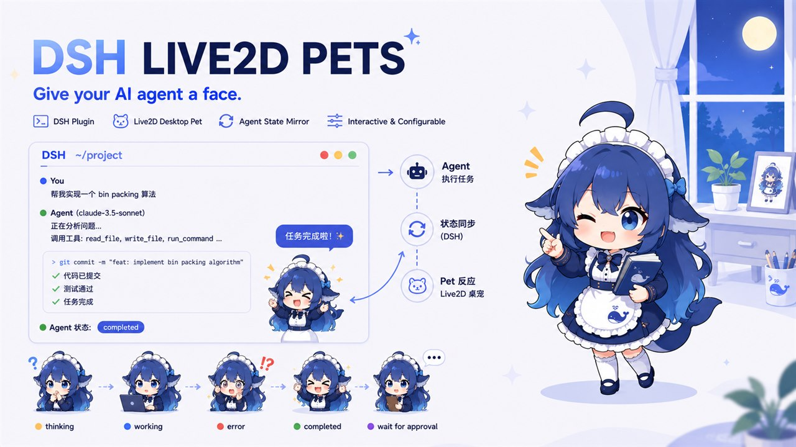
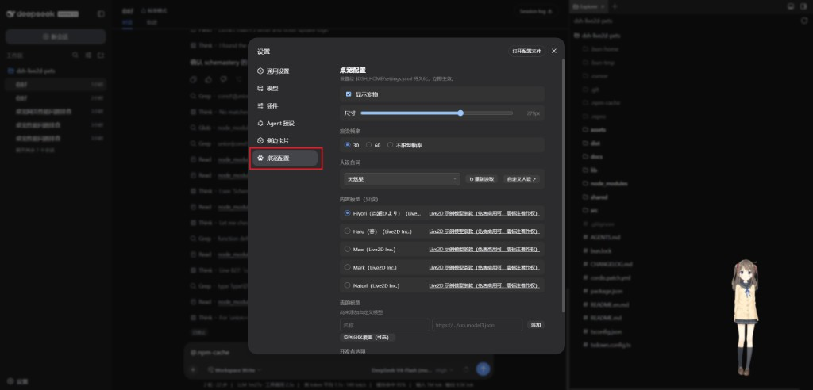

# dsh-live2d-pets 🐾

English | [简体中文](README.md)

[](https://www.npmjs.com/package/dsh-live2d-pets)
[](https://opensource.org/licenses/MIT)
[](https://nodejs.org/)
[](https://github.com/cyanfish-x/dsh-live2d-pets/releases)
[](https://github.com/topics/dsh-plugin)

A Live2D desk-pet plugin for **DeepSeek Harness (DSH)**: a **characterful companion for your agent** — follows session state, switch personas, bring your own model.

<p align="center">
  
</p>

## Features

- **Model loading**: 5 curated presets (Hiyori / Haru / Mao / Mark / Natori) plus custom entries; any `.model3.json` over **https / http**, or a locally reachable model URL; custom models support **animation mapping** to bind native motion groups to pet states / touch interactions
- **State mirroring**: the pet reflects agent thinking / idle / error / done / waiting-for-approval (motion + bubbles, SSE push)
- **Personas**: six built-in tones (tsundere / genki / airhead / kuudere / gentle / yandere); custom personas via a plugin-owned JSONC file with hot reload
- **Companionship**: part-based tap reactions / mouse-follow (head, eyes and body look toward the pointer) / free drag docking / task-done celebration; when HitAreas are sparse, spatial fallback uses five AABB rectangles
- **Settings panel**: DSH Settings → “Pet config” — enable, size, FPS, persona, models, developer options; scalar settings are persisted to `~/.dsh/settings.yaml`, while custom personas and custom models live in `~/.dsh/live2d-pet/` plugin-owned JSONC files; applies immediately
- **Stay out of the way**: bottom-right by default, small size, draggable, hideable, pause rendering when the tab is hidden, FPS cap, static avatar fallback on low end

## Quick start

### Option A: Paste a prompt for your agent (recommended)

Copy this into a DSH Web GUI chat and let the agent install and verify:

```text
Please install the dsh-live2d-pets plugin (Live2D desk pet for DSH):
1. Run: dsh plugin --profile web add dsh-live2d-pets
2. Run: dsh plugin --profile web list and confirm dsh-live2d-pets is installed
3. Report the result; if it fails, include the error output
```

### Option B: Manual install

```sh
dsh plugin --profile web add dsh-live2d-pets
```

The plugin is enabled by default after install. Start DSH:

```sh
dsh web
```

Open the browser — a default pet (160px) appears at the bottom-right. Default model is Hiyori (Live2D sample); first load needs network.

### Interaction

- **Mouse follow** (enabled by default): as the pointer moves anywhere on the page, the pet’s head, eyes and body smoothly look toward it; when the pointer leaves the page it resets to face front. It pauses while dragging, hidden, or when the tab/window is not focused.
- **Tap interactions**: touching the head / legs / arms / body triggers its own line and motion; when a model has sparse HitAreas, spatial fallback zones are used.
- **Drag**: hold and drag the pet anywhere, then release to dock it; the position is persisted.

Custom models: Settings → “Pet config” → “My models”, add a name + `.model3.json` URL (CDN, self-hosted static, or local HTTP). Expand **Spatial tap override** to tune the five rectangles (0–1; leave blank for defaults), or expand **Animation mapping** to parse the model’s native motion groups and bind them to states / touch interactions. Pair with developer option **Show tap zones**. Built-in Hiyori ships with a centered preset.

### Configuration

Open **DSH Settings → “Pet config”**. Changes apply immediately — no restart.

<p align="center">
  
</p>

- **Show pet**: on / off
- **Size**: 40–400px (default 160)
- **Render FPS**: 30 / 60 / unlimited (default 30)
- **Personas**: switch built-in or custom tones; “Custom personas ↗” edits `$DSH_HOME/live2d-pet/personas.jsonc`, then hit “↻ Reload”
- **Models**: pick a curated preset, or add name + `.model3.json` URL under “My models” (optional spatial-tap / animation mapping); custom models live in `$DSH_HOME/live2d-pet/custom-models.jsonc`
- **Developer options**: master toggle (off by default); when enabled, shows the debug panel (with native model animation list preview) and the tap-zone overlay

### Uninstall

```sh
dsh plugin --profile web remove dsh-live2d-pets
```

## Docs

| Need | Doc |
|------|------|
| Chinese README | [`README.md`](README.md) |
| Product intent | [`docs/intent/live2d-pet-plugin.md`](docs/intent/live2d-pet-plugin.md) (Chinese) |
| Behavior spec | [`docs/spec/live2d-pet-v01.md`](docs/spec/live2d-pet-v01.md) (Chinese) |
| Architecture decisions | [`docs/adr/`](docs/adr/) (rendering stack: ADR-003) |
| Research notes | [`docs/research/`](docs/research/) (settings panel: settings-tab.md) |

## Stack

- pixi-live2d-display 0.4.0 + PixiJS 6.5.10 + Cubism Core 4 ([ADR-003](docs/adr/003-spike-results-and-rendering-stack.md))
- Client renders in DSH Web GUI `shell.overlay` (Popover top layer, [ADR-005](docs/adr/005-pet-visual-top-layer-popover.md)); settings section on `settings.section` ([ADR-002](docs/adr/002-pet-mount-and-state-source.md))
- State push: Host subscribes to `agent/*` → same-origin SSE `/api/live2d-pet/events` ([ADR-006](docs/adr/006-push-state-sse.md)); pause when tab hidden / blurred
- Settings: scalar settings via Host `ctx.settings` (`~/.dsh/settings.yaml` over base); custom personas at `~/.dsh/live2d-pet/personas.jsonc`, custom models at `~/.dsh/live2d-pet/custom-models.jsonc` are read/written by the plugin; transport via plugin API `/api/live2d-pet/settings` (settingsScope wire allowlist limits — [research 3.4/3.5](docs/research/settings-tab.md))

## License

- **Plugin code**: MIT
- **Model list**: URL-only, not shipped in the package; each entry must record license type + link; NC models marked non-commercial only ([`src/presets/presets.jsonc`](src/presets/presets.jsonc))
- **Built-in Hiyori / Haru / Mao / Mark / Natori**: Live2D sample models under the [Sample Model Terms](https://www.live2d.com/eula/live2d-sample-model-terms_en.html) (free for commercial use with attribution)
- **Live2D SDK**: follow [Live2D official terms](https://www.live2d.com/en/download/cubism-sdk/)
